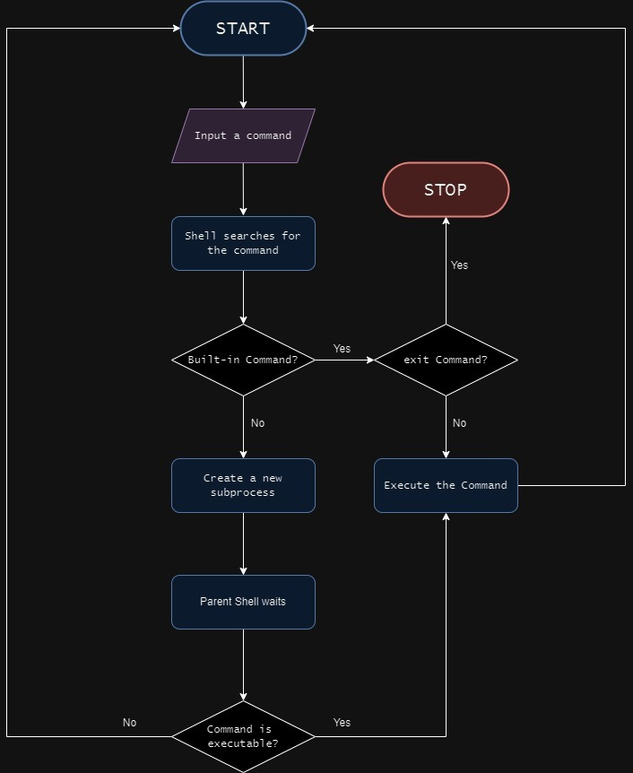

# Simple Shell Project

## Description

This project is an implementation of a basic UNIX command interpreter, developed as part of the Holberton School curriculum. Our shell, named `hsh`, can execute commands and manage processes, mimicking core functionalities of the standard shell (sh).

## Flowchart

## Features

- Execution of simple commands
- PATH handling for locating executables
- Error management with appropriate error messages
- Interactive and non-interactive modes support

## Compilation

To compile the shell, use the following command:

gcc -Wall -Werror -Wextra -pedantic -std=gnu89 *.c -o hsh
text

## Usage

After compilation, run the shell using:

./hsh
text

### Interactive Mode

$ ./hsh
($) /bin/ls
hsh main.c shell.c
($) exit
$
text

### Non-Interactive Mode

$ echo "/bin/ls" | ./hsh
hsh main.c shell.c test_ls_2
$
text

## Command Examples

- `ls`: List directory contents
- `pwd`: Print working directory
- `exit`: Exit the shell

## Learning Objectives

Through this project, we've gained understanding of:

- The original Unix operating system and its designers
- The first version of the UNIX shell and its author
- The B programming language and its inventor
- Ken Thompson's contributions to computer science
- Shell functionality and process management
- Environment manipulation in current processes
- Differences between functions and system calls
- Process creation and management
- Main function prototypes
- PATH usage in shell program location
- Program execution using the execve system call
- Process suspension and child process termination
- EOF (End-of-File) concept

## Authors

- [Alexandre Mousse](https://github.com/Alex-git-pro)
- [Kevin Rouget](https://github.com/koryos77)
- [Antoine Musci](https://github.com/Entwoane)

## License

This project is part of the Holberton School curriculum.